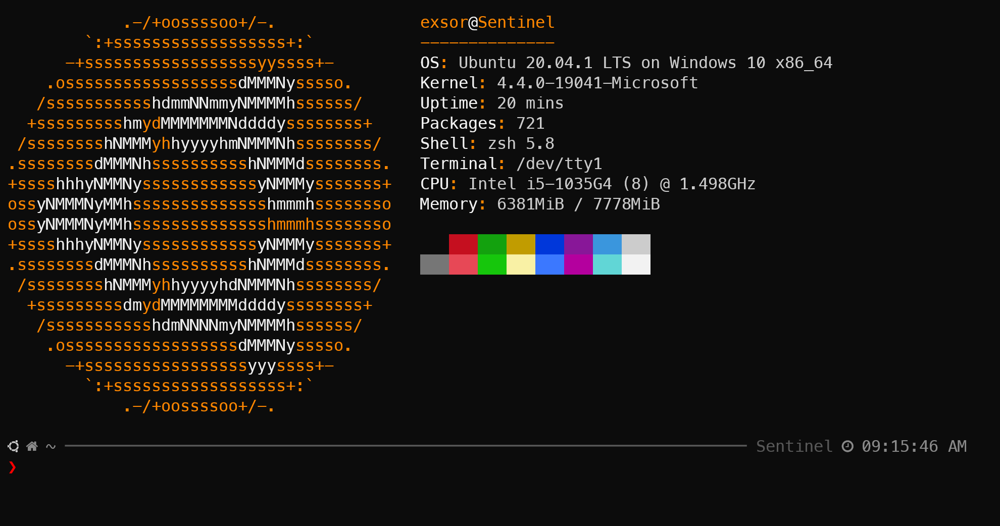

# My OhMyZsh Setup



&nbsp;  

## Install Oh My Zsh with curl

`sh -c "$(curl -fsSL https://raw.githubusercontent.com/ohmyzsh/ohmyzsh/master/tools/install.sh)"`

Note: You need to have ZSH installed before installing Oh My Zsh. Have a look at [Installing ZSH](https://github.com/ohmyzsh/ohmyzsh/wiki/Installing-ZSH)


## Using a customized theme

### PowerLevel10k - my current favorite theme to use. 

[https://github.com/romkatv/powerlevel10k](https://github.com/romkatv/powerlevel10k)

*note: that you need to install fonts for it to work correctly.*

```bash
git clone --depth=1 https://github.com/romkatv/powerlevel10k.git ${ZSH_CUSTOM:-$HOME/.oh-my-zsh/custom}/themes/powerlevel10k
```

Set `ZSH_THEME="powerlevel10k/powerlevel10k"` in `~/.zshrc.`

Recommend to install font manager to install the font system-wide. 

```bash
sudo apt install font-manager
```

Then download the font's like: 

```bash
curl -o ./MesloLGS-NF-Regular.ttf https://github.com/romkatv/powerlevel10k-media/raw/master/MesloLGS%20NF%20Regular.ttf
curl -o ./MesloLGS-NF-Bold.ttf https://github.com/romkatv/powerlevel10k-media/raw/master/MesloLGS%20NF%20Bold.ttf
curl -o ./MesloLGS-NF-Italic.ttf https://github.com/romkatv/powerlevel10k-media/raw/master/MesloLGS%20NF%20Italic.ttf
curl -o ./MesloLGS-NF-Bold-Italic.ttf https://github.com/romkatv/powerlevel10k-media/raw/master/MesloLGS%20NF%20Bold%20Italic.ttf
```

*Copy all fonts to `/usr/local/share/fonts/`*

&nbsp;  
### (OR) you can use the simple theme I made.
&nbsp;  


### Using my customized theme - xtheme. 

I customized robbyrussell.zsh-theme to add hostname in the prompt. The ordinal can by found here: https://github.com/ohmyzsh/ohmyzsh/blob/master/themes/robbyrussell.zsh-theme

### Download xtheme by

`curl -o $ZSH_CUSTOM/themes/xtheme.zsh-theme https://raw.githubusercontent.com/eXsoR65/my-ohmyzsh-setup/main/xtheme.zsh-theme`

- `nano ~/.zshrc` and find ZSH_THEME="robbyrussell"
-  Change it to ZSH_THEME="xtheme"

&nbsp;  

## **Plugins** I use the most (zsh-autosuggestions & zsh-syntax-highlighting)
 - Download zsh-autosuggestions by
 
 `git clone https://github.com/zsh-users/zsh-autosuggestions.git $ZSH_CUSTOM/plugins/zsh-autosuggestions`
 
 - Download zsh-syntax-highlighting by
 
 `git clone https://github.com/zsh-users/zsh-syntax-highlighting.git $ZSH_CUSTOM/plugins/zsh-syntax-highlighting`

 - Modify you .zshrc file to add the plugins Example: `nano ~/.zshrc`
 
 - Append `zsh-autosuggestions & zsh-syntax-highlighting` to  plugins()
 Should look like this: `plugins=(git zsh-autosuggestions zsh-syntax-highlighting)`
 
 - Reload your .zshrc to apply changes with `source ~/.zshrc`.


## If you want other users to have ohmyzsh then just do the below.
**Make sure that zsh is already installed.**
Then login as another user of the system:

- `export ZSH=/home/username_here/.oh-my-zsh`
- `sh -c "$(curl -fsSL https://raw.github.com/ohmyzsh/ohmyzsh/master/tools/install.sh)"`

 ## Ref
 - [oh-my-zsh](https://github.com/robbyrussell/oh-my-zsh)
 - [zsh-autosuggestions](https://github.com/zsh-users/zsh-autosuggestions)
 - [zsh-syntax-highlighting](https://github.com/zsh-users/zsh-syntax-highlighting)
